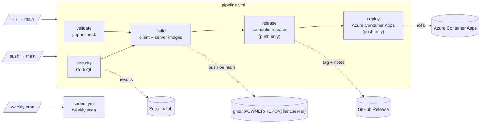

# CI/CD

How continuous integration and delivery work in this monorepo. Everything runs as **one gated
pipeline** ([`pipeline.yml`](../.github/workflows/pipeline.yml)); the only separate workflow is the
weekly security scan. Shared setup lives in [`.github/actions`](../.github/actions).

## At a glance

| Workflow | Trigger | What it does |
|---|---|---|
| [`pipeline.yml`](../.github/workflows/pipeline.yml) | PR → `main`, push → `main` | The full sequence: validate → security → build → release → deploy |
| [`codeql.yml`](../.github/workflows/codeql.yml) | weekly cron | Scheduled CodeQL scan (shares [`_codeql.yml`](../.github/workflows/_codeql.yml) with the pipeline) |

Docs-only changes (`docs/**`, `**/*.md`) are skipped. Azure provisioning: [deploy-azure.md](deploy-azure.md).

## The pipeline

Jobs are chained with `needs:`, so **nothing deploys unless every prior stage passed**. On a pull
request the sequence stops after `build` (no push, release, or deploy); on push to `main` it runs
end to end.



### Stages

1. **validate** — `pnpm check` across the workspace: client (Biome + `tsc` + rstest), server
   (Biome + `tsc --noEmit` + unit tests), storybook (build). No database required.
2. **security** — CodeQL (`javascript-typescript`, `build-mode: none`) via the reusable
   [`_codeql.yml`](../.github/workflows/_codeql.yml). Runs in parallel with `validate`; results land
   in the **Security → Code scanning** tab. Excluded paths live in
   [`.github/codeql/codeql-config.yml`](../.github/codeql/codeql-config.yml).
3. **build** — `needs: [validate, security]`. Matrix over `client` and `server`; each
   [Dockerfile](../apps/server/Dockerfile) builds from the **monorepo root** context and uses
   `pnpm fetch` + `pnpm deploy` for a lean, self-contained runtime. **On a PR** the images are built
   only (verifies the Dockerfiles, safe for forks). **On push to `main`** they are pushed to
   `ghcr.io/<owner>/<repo>/{client,server}`, tagged `sha-<commit>` and `latest`, with `type=gha`
   layer caching.
4. **release** — `needs: build`, **push only**. `pnpm --filter @e-commerce/server semantic-release`
   reads conventional commits and, when there is something to release, updates
   `apps/server/CHANGELOG.md`, commits it back with `chore(release): <version> [skip ci]` (the
   `[skip ci]` avoids a loop), and creates the git tag + GitHub Release. GitHub Releases only, no npm
   publish. Config: [`apps/server/.releaserc`](../apps/server/.releaserc).
5. **deploy** — `needs: release`, **push only**. `azure/login@v3` authenticates via **OIDC** (no
   long-lived secrets), then `azure/cli@v3` rolls each Container App to `:latest` (server first, then
   client). Uses the `production` environment.

### Required secrets / variables (deploy)

- **Secrets:** `AZURE_CLIENT_ID`, `AZURE_TENANT_ID`, `AZURE_SUBSCRIPTION_ID`.
- **Variables:** `AZURE_RESOURCE_GROUP`, `AZURE_SERVER_APP`, `AZURE_CLIENT_APP`.
- A repo **environment** named `production`.

See [deploy-azure.md](deploy-azure.md) for how these are created.

## Weekly security scan

[`codeql.yml`](../.github/workflows/codeql.yml) runs only on a weekly cron and calls the same
reusable [`_codeql.yml`](../.github/workflows/_codeql.yml) the pipeline uses, so PR/push scans and
the scheduled scan stay in sync.

## Shared building blocks

| Piece | Purpose |
|---|---|
| [`actions/setup`](../.github/actions/setup/action.yml) | Install pnpm, then Node (pnpm cache), then `pnpm install --frozen-lockfile`. Used by `validate` and `release`. |
| [`_codeql.yml`](../.github/workflows/_codeql.yml) | Reusable CodeQL analysis, called by the pipeline's `security` job and the weekly scan. |

**pnpm ordering matters:** `pnpm/action-setup` runs *before* `setup-node`, otherwise `cache: pnpm`
can't find the binary. The pnpm version is read from the root `package.json` `packageManager` field.

## Conventions

- **Node 24.18** (pinned in the setup action and the Dockerfiles), **pnpm** via `packageManager`.
- **Action versions** pinned to current majors: `checkout@v7`, `setup-node@v6`,
  `pnpm/action-setup@v6`, `codeql-action@v4`, `docker/*` (buildx@v4, login@v4, metadata@v6,
  build-push@v7), `azure/login@v3`, `azure/cli@v3`.
- **Conventional commits** drive releases (Angular preset): `feat:` → minor, `fix:` → patch,
  `refactor:`/`style:`/`docs(README):` → patch, `BREAKING CHANGE:` → major.

## Reproduce locally

```bash
pnpm check                                                       # the validate stage
docker build -f apps/server/Dockerfile -t e-commerce-server .    # server image (root context)
docker build -f apps/client/Dockerfile -t e-commerce-client .    # client image (root context)
docker compose -f apps/server/docker-compose.yml build app       # same via compose
```

## Current state and limitations

- **`main` is unprotected (by design, for now).** The `release` stage pushes the CHANGELOG/tag commit
  straight to `main` using `GITHUB_TOKEN`. If branch protection that blocks direct pushes is added,
  the release push needs a bypass (or drop the `@semantic-release/git` plugin so it only tags +
  releases, no in-repo CHANGELOG commit).
- **No DB/e2e gate yet.** The server's Cucumber e2e + `dbmate` migrations (need Postgres) and the
  client's Playwright e2e are not wired into the pipeline.
- **Deploy uses `:latest`.** Fine for a single-environment setup; switch to image digests for fully
  immutable rollouts.

## Leftover cleanup (not urgent)

`apps/server/client` (`@marcoturi/fastify-boilerplate`) and the `@semantic-release/npm` /
`@semantic-release/exec` devDependencies are no longer used; template residue that can be removed
separately.
