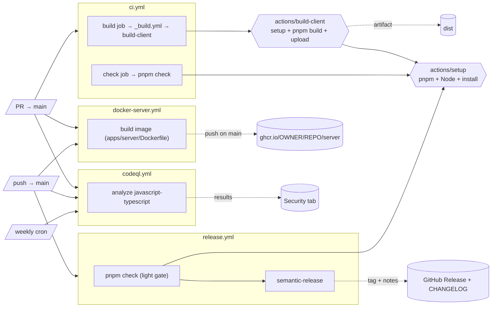

# CI/CD

How continuous integration and delivery work in this monorepo. All workflows live in
[`.github/workflows`](../.github/workflows); shared setup lives in
[`.github/actions`](../.github/actions).

## At a glance

| Workflow | Trigger | What it does | Publishes |
|---|---|---|---|
| [`ci.yml`](../.github/workflows/ci.yml) | PR → `main` | Build the client + validate the whole workspace | `dist` artifact |
| [`docker-server.yml`](../.github/workflows/docker-server.yml) | PR → `main` (build only), push → `main` (build + push) | Build the server container image | GHCR image (on `main`) |
| [`codeql.yml`](../.github/workflows/codeql.yml) | PR → `main`, push → `main`, weekly cron | Static analysis (JS/TS) | Security tab alerts |
| [`release.yml`](../.github/workflows/release.yml) | push → `main` | Validate, then cut a versioned GitHub Release | Git tag + GitHub Release + CHANGELOG |

`_build.yml` is a **reusable** workflow (`workflow_call`), not triggered on its own; `ci.yml` calls it.

## Block diagram (what we have now)



## Workflows in detail

### `ci.yml`: PR validation

Two jobs run in parallel on every PR to `main`:

- **build** → calls the reusable [`_build.yml`](../.github/workflows/_build.yml), which runs the
  [`build-client`](../.github/actions/build-client/action.yml) composite: install, `pnpm build`,
  upload `apps/client/dist` as the `dist` artifact. `if-no-files-found: error` fails the build
  loudly rather than uploading an empty artifact if the output path ever moves.
- **check** → `pnpm check` across the workspace: client (Biome + `tsc` + rstest), server
  (Biome + `tsc --noEmit` + unit tests), storybook (build). **No database required**: the server
  unit tests are pure.

### `docker-server.yml`: server image

The server has **no JS bundle**; it runs TypeScript directly on Node 24. Its deployable artifact is
a **container image**. The [Dockerfile](../apps/server/Dockerfile) builds from the **monorepo root**
context (pnpm needs the root lockfile) and uses `pnpm deploy` to produce a self-contained runtime:

- **On a PR:** the image is **built only** (verifies the Dockerfile). No registry login, so it is
  safe for forks.
- **On push to `main`:** the image is built **and pushed** to `ghcr.io/<owner>/<repo>/server`,
  tagged `sha-<commit>` and `latest`. Uses the built-in `GITHUB_TOKEN` (`packages: write`); no
  secrets to configure. Layer caching via `type=gha`.

Path-filtered: only runs when `apps/server/**`, the lockfile, the workspace file, or the workflow
itself changes.

### `codeql.yml`: static analysis

Scans the whole monorepo as one CodeQL language (`javascript-typescript`) with `build-mode: none`
(no compilation needed). Runs on PRs, pushes to `main`, and weekly. Excluded paths (build outputs,
`examples`, `docs`, tests, stories) live in
[`.github/codeql/codeql-config.yml`](../.github/codeql/codeql-config.yml). Results land in the
repository's **Security → Code scanning** tab.

### `release.yml`: GitHub Releases

On push to `main`: run the light gate (`pnpm check`), then
`pnpm --filter @e-commerce/server semantic-release`. semantic-release (config in
[`apps/server/.releaserc`](../apps/server/.releaserc)) reads conventional commits and, when there is
something to release:

1. computes the next version,
2. updates `apps/server/CHANGELOG.md`,
3. commits it back with `chore(release): <version> [skip ci]` (the `[skip ci]` prevents a workflow
   loop),
4. creates the git tag and the GitHub Release with generated notes.

**GitHub Releases only, no npm publish.** The template's original npm publishing (of the unrelated
`@marcoturi/fastify-boilerplate` package) was removed. Runs on the built-in `GITHUB_TOKEN`; no
secrets required.

## Shared building blocks

| Action | Purpose |
|---|---|
| [`actions/setup`](../.github/actions/setup/action.yml) | Install pnpm, then Node (with pnpm cache), then `pnpm install --frozen-lockfile`. Used by the check job, the release job, and (transitively) the build. |
| [`actions/build-client`](../.github/actions/build-client/action.yml) | `setup` + `pnpm build` + upload the `dist` artifact. |

**pnpm ordering matters:** `pnpm/action-setup` runs *before* `setup-node`, otherwise
`cache: pnpm` can't find the binary. The pnpm version is read from the root `package.json`
`packageManager` field; never passed explicitly (that would error with "multiple versions").

## Conventions

- **Node 24**, **pnpm** pinned via `packageManager` (`corepack`).
- **Action versions** are pinned to current majors: `checkout@v7`, `setup-node@v6`,
  `upload-artifact@v7`, `pnpm/action-setup@v6`, `codeql-action@v4`, `docker/*` (buildx@v4,
  login@v4, metadata@v6, build-push@v7).
- **Conventional commits** drive releases (Angular preset). `feat:` → minor, `fix:` → patch,
  `refactor:`/`style:`/`docs(README):` → patch, `BREAKING CHANGE:` → major.

## Reproduce locally

```bash
pnpm check                               # exactly what the check job runs
pnpm build                               # client build → apps/client/dist
docker build -f apps/server/Dockerfile -t e-commerce-server .   # server image (root context)
docker compose -f apps/server/docker-compose.yml build app      # same via compose
```

## Current state and limitations

- **`main` is unprotected (by design, for now).** `release.yml` pushes the CHANGELOG/tag commit
  straight to `main` using `GITHUB_TOKEN`. If branch protection is added later (required PRs or
  status checks that block direct pushes), the release push will fail; it would then need a PAT or
  a GitHub App token, or the `@semantic-release/git` plugin can be dropped (tag + release notes only,
  no in-repo CHANGELOG commit).
- **First release** cuts `v1.0.0` (semantic-release derives the version from git tags, not
  `package.json`).
- **No DB/e2e gate in CI yet.** The server's Cucumber e2e + `dbmate` migrations (which need a
  Postgres service) and the client's Playwright e2e are not wired into CI. The release gate is
  intentionally light (`pnpm check`).
- **GHCR package visibility.** After the first push, the image package defaults to **private**;
  make it public in the package settings if it should be pullable without auth.

## Leftover cleanup (not urgent)

`apps/server/client` (`@marcoturi/fastify-boilerplate`) and the `@semantic-release/npm` /
`@semantic-release/exec` devDependencies are no longer used by any workflow; template residue that
can be removed in a separate change.
