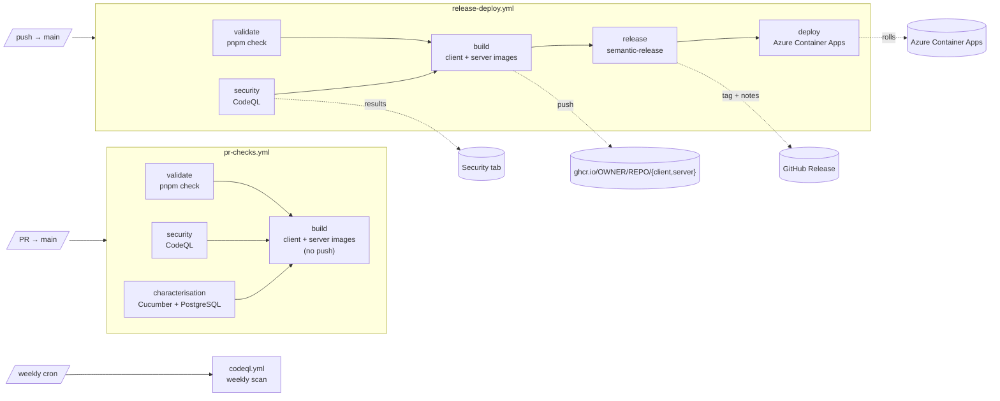

# CI/CD

How continuous integration and delivery work in this monorepo. CI and CD are **two separate
workflows** that never run in the same event: [`pr-checks.yml`](../.github/workflows/pr-checks.yml)
gates a pull request, [`release-deploy.yml`](../.github/workflows/release-deploy.yml) runs after a
merge to `main`. Shared setup lives in [`.github/actions`](../.github/actions).

## At a glance

| Workflow | Trigger | What it does |
|---|---|---|
| [`pr-checks.yml`](../.github/workflows/pr-checks.yml) | PR → `main` | Parallel validate, security, and characterisation jobs gate build (images built, not pushed). |
| [`release-deploy.yml`](../.github/workflows/release-deploy.yml) | push → `main`, manual dispatch | validate → security → build → release → deploy |
| [`codeql.yml`](../.github/workflows/codeql.yml) | weekly cron | Scheduled CodeQL scan (shares [`_codeql.yml`](../.github/workflows/_codeql.yml) with both workflows above) |

Docs-only changes (`docs/**`, `**/*.md`) are skipped. Azure provisioning: [deploy-azure.md](deploy-azure.md).

## The workflows

Both workflows chain their jobs with `needs:`, so **nothing builds/releases/deploys unless every
prior stage passed**. `pr-checks.yml` stops after `build` (no push, release, or deploy);
`release-deploy.yml` runs the full chain end to end.


```mermaid
flowchart LR
  PR[/"PR → main"/]
  PUSH[/"push → main"/]
  CRON[/"weekly cron"/]

  subgraph PRC["pr-checks.yml"]
    direction LR
    PVALIDATE["validate<br/>pnpm check"]
    PSECURITY["security<br/>CodeQL"]
    PCHARACTERISATION["characterisation<br/>Cucumber + PostgreSQL"]
    PBUILD["build<br/>client + server images<br/>(no push)"]
    PVALIDATE --> PBUILD
    PSECURITY --> PBUILD
    PCHARACTERISATION --> PBUILD
  end

  subgraph RD["release-deploy.yml"]
    direction LR
    VALIDATE["validate<br/>pnpm check"]
    SECURITY["security<br/>CodeQL"]
    BUILD["build<br/>client + server images"]
    RELEASE["release<br/>semantic-release"]
    DEPLOY["deploy<br/>Azure Container Apps"]
    VALIDATE --> BUILD
    SECURITY --> BUILD
    BUILD --> RELEASE --> DEPLOY
  end

  PR --> PRC
  PUSH --> RD
  CRON --> WEEKLY["codeql.yml<br/>weekly scan"]

  BUILD -. push .-> GHCR[("ghcr.io/OWNER/REPO/{client,server}")]
  SECURITY -. results .-> SEC[("Security tab")]
  RELEASE -. "tag + notes" .-> REL[("GitHub Release")]
  DEPLOY -. rolls .-> AZ[("Azure Container Apps")]
```

### Stages

1. **validate** — `pnpm check` across the workspace: client (Biome + `tsc` + rstest), server
   (Biome + `tsc --noEmit` + unit tests), storybook (build). No database required. Runs in both
   workflows (each is self-contained; a PR run and the post-merge run are independent).
2. **security** — CodeQL (`javascript-typescript`, `build-mode: none`) via the reusable
   [`_codeql.yml`](../.github/workflows/_codeql.yml). Runs in parallel with `validate`; results land
   in the **Security → Code scanning** tab. Excluded paths live in
   [`.github/codeql/codeql-config.yml`](../.github/codeql/codeql-config.yml).
3. **characterisation** runs only in PR Checks, in parallel with `validate` and `security`.
   It applies migrations and seeds to an isolated PostgreSQL service, then runs
   `pnpm --filter @e-commerce/server test:characterisation`. Configuration comes from job
   environment variables, not a local `.env` file. Shared-contract changes run this job too;
   it has no additional path filter. Image builds wait for it to pass.
4. **build** requires `validate` and `security`, plus `characterisation` in PR Checks. The matrix contains `client`, `server` and `migrations`; each application
   [Dockerfile](../apps/server/Dockerfile) builds from the **monorepo root** context and uses
   `pnpm fetch` + `pnpm deploy` for a lean, self-contained runtime. **In `pr-checks.yml`** the images
   are built only (verifies the Dockerfiles, safe for forks, no registry login). **In
   `release-deploy.yml`** they are pushed to `ghcr.io/<owner>/<repo>/{client,server,migrations}`, with existing tags and `type=gha` caching retained. The migrations image uses its database directory as context. Exact build digests and source/run identities are retained as artifacts, with unique build tags for image retention.
5. **release** — `needs: build`, **`release-deploy.yml` only**.
   `pnpm --filter @e-commerce/server semantic-release` reads conventional commits and, when there is
   something to release, creates a Git tag and publishes generated notes in a GitHub Release.
   It does not create a commit, update the repository changelog or rewrite package versions.
   GitHub Releases only, no npm publish. Config:
   [`apps/server/.releaserc`](../apps/server/.releaserc).
6. **deploy** authenticates through OIDC in the `production` environment. It persists verified predecessor identities, runs migrations by digest, then gates the intended server and client revisions on readiness and read-only HTTP checks. Failed rollout recovery is verified, but the release remains failed. See [deployment and recovery](deployment-recovery.md) for the first tagged-image transition, retained artifacts, probes and operator procedures. Production runs are serialised and restricted to `main`.

### Required secrets / variables (deploy)

- **Secrets:** `AZURE_CLIENT_ID`, `AZURE_TENANT_ID`, `AZURE_SUBSCRIPTION_ID`.
- **Variables:** `AZURE_RESOURCE_GROUP`, `AZURE_SERVER_APP`, `AZURE_CLIENT_APP`; `PREDECESSOR_IMAGES` is required while a tagged predecessor needs operator-verified historical evidence.
- A repo **environment** named `production`.

See [deploy-azure.md](deploy-azure.md) for how these are created.

## Weekly security scan

[`codeql.yml`](../.github/workflows/codeql.yml) runs only on a weekly cron and calls the same
reusable [`_codeql.yml`](../.github/workflows/_codeql.yml) that `pr-checks.yml` and
`release-deploy.yml` use, so PR/push scans and the scheduled scan stay in sync.

## Shared building blocks

| Piece | Purpose |
|---|---|
| [`actions/setup`](../.github/actions/setup/action.yml) | Install pnpm, then Node (pnpm cache), then `pnpm install --frozen-lockfile`. Used by `validate`, PR characterisation, and `release`. |
| [`_codeql.yml`](../.github/workflows/_codeql.yml) | Reusable CodeQL analysis, called by each workflow's `security` job. |

**pnpm ordering matters:** `pnpm/action-setup` runs *before* `setup-node`, otherwise `cache: pnpm`
can't find the binary. The pnpm version is read from the root `package.json` `packageManager` field.

## Conventions

- **Node 24.18** (pinned in the setup action and the Dockerfiles), **pnpm** via `packageManager`.
- **Action versions** pinned to current majors: `checkout@v7`, `setup-node@v6`,
  `pnpm/action-setup@v6`, `codeql-action@v4`, `docker/*` (buildx@v4, login@v4, metadata@v6,
  build-push@v7), `azure/login@v3`, `azure/cli@v3`.
- **Conventional commits** drive releases (Angular preset): `feat:` → minor, `fix:` → patch,
  `refactor:`/`style:`/`docs(README):` → patch, `BREAKING CHANGE:` → major.

## Reproduce locally

```bash
pnpm check                                                       # the validate stage
docker build -f apps/server/Dockerfile -t e-commerce-server .    # server image (root context)
docker build -f apps/client/Dockerfile -t e-commerce-client .    # client image (root context)
docker compose -f apps/server/docker-compose.yml build app       # same via compose
```

## Current state and limitations

- **`main` remains protected.** Releases publish tags and GitHub release notes without generating
  commits that would require a new set of branch checks. The historical repository changelog is
  retained; future changelog edits must pass through a PR. Azure deployment remains enabled after
  a successful release, subject to its existing gates and production environment policy.
- **Characterisation gates PRs only.** The release workflow does not rerun the server's
  database-backed suite. Playwright browser E2E tests are not wired into either workflow.
- **Live rollout verification remains distinct from tests.** `pnpm check` includes deterministic deployment checks. Actual production revision mode, probe configuration and recovery must be verified during an authorised rollout; implementation does not imply that deployment occurred.

## Leftover cleanup (not urgent)

`apps/server/client` (`@marcoturi/fastify-boilerplate`) and the `@semantic-release/npm` /
`@semantic-release/exec` devDependencies are no longer used; template residue that can be removed
separately.
