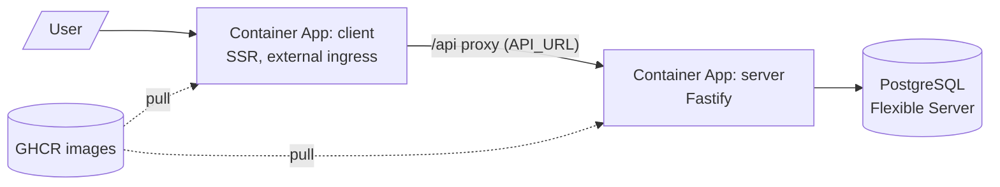

# Deploy to Azure Container Apps

How the storefront is deployed to Azure: the **client** (SSR) and **server** (Fastify API) run as
two Azure Container Apps pulling images from GHCR, backed by a managed **PostgreSQL Flexible
Server**. GitHub Actions publishes the images and rolls the apps via OIDC (no long-lived secrets).



## Cost (be realistic)

- **Compute (Container Apps, Consumption):** scales to zero when idle, so low-traffic hobby usage is
  roughly **$0/month** within the monthly free grant.
- **Database:** a managed Flexible Server **cannot** scale to zero. Burstable **B1ms** is about
  **$13/month**. New Azure accounts often get a **12-month free** PostgreSQL Flexible Server offer
  (B1ms + 32 GB) that likely covers this, verify the current terms on the pricing page in the portal.
- **Registry:** GHCR (already used), free for public images.

So plan for **compute ≈ $0**, **DB ≈ free for 12 months, then ~$13/month**.

## Prerequisites

- Azure CLI (`az`) logged in (`az login`), and you are **Owner** of the subscription (confirmed).
  Run `az upgrade` first: an outdated CLI rejects newer flags (e.g. `--database-name`,
  `--public-network-access`) with "unrecognized arguments".
- The images exist in GHCR. They are published by [`docker-images.yml`](../.github/workflows/docker-images.yml)
  on push to `main`, so **merge the deploy PR first**, then provision.

Set shared variables (run everything from the repo root):

```bash
SUB=$(az account show --query id -o tsv)
RG=e-commerce-rg
# Container Apps runs on a managed AKS backend, so a full region fails env
# creation with "not accepting new customers" or "AKSCapacityHeavyUsage".
# If so, try another: germanywestcentral, northeurope, uksouth, or eastus2.
# Use the SAME region for the Postgres server in step 2.
LOC=germanywestcentral
ENV=e-commerce-env
REPO=ydunets/e-commerce
PG=ecommerce-pg-$RANDOM            # must be globally unique
PG_ADMIN=pgadmin
PG_PASS='ChangeMe-Strong-Passw0rd' # use your own strong value
PG_DB=ecommerce
```

## Step 1: Resource group + Container Apps environment

```bash
az group create -n $RG -l $LOC
az containerapp env create -n $ENV -g $RG -l $LOC
```

## Step 2: PostgreSQL Flexible Server + database

The DB can live in a different region than the apps (its DNS name is global and the
`AllowAzureServices` rule permits cross-region access). Some regions restrict Flexible Server
provisioning, so pick a supported one for `PG_LOC` (e.g. northeurope, francecentral, uksouth):

```bash
PG_LOC=northeurope   # DB region; may differ from the apps' $LOC

# `--public-access 0.0.0.0` enables the public endpoint AND adds the "allow Azure
# services" firewall rule in one step. (Do not use `None`: in current CLI it
# disables public access entirely, so no firewall rules can be added afterwards.)
az postgres flexible-server create \
  -g $RG -n $PG -l $PG_LOC \
  --tier Burstable --sku-name Standard_B1ms --storage-size 32 \
  --admin-user $PG_ADMIN --admin-password "$PG_PASS" \
  --public-access 0.0.0.0

# Create the application database (separate command works across az CLI versions;
# some versions of `flexible-server create` do not accept --database-name).
az postgres flexible-server db create -g $RG -s $PG -d $PG_DB

# Allow your laptop's IP so you can run migrations from here.
MY_IP=$(curl -s https://api.ipify.org)
az postgres flexible-server firewall-rule create -g $RG -n $PG \
  --rule-name my-laptop --start-ip-address $MY_IP --end-ip-address $MY_IP

PG_HOST=$PG.postgres.database.azure.com
```

## Step 3: Run migrations (and optional seed)

Azure Postgres enforces TLS, so the connection string uses `sslmode=require`:

```bash
export DBMATE_DATABASE_URL="postgres://$PG_ADMIN:$PG_PASS@$PG_HOST:5432/$PG_DB?sslmode=require"
pnpm --filter @e-commerce/server db:migrate
pnpm --filter @e-commerce/server db:seed     # optional sample data
```

## Step 4: GHCR image access

Container Apps must be able to pull the images. Pick one:

- **Simplest, make the packages public:** GitHub → your profile/org → Packages → `client` and
  `server` → Package settings → Change visibility → Public. Then no registry credentials are needed.
- **Keep them private:** create a GitHub PAT with `read:packages` and pass
  `--registry-server ghcr.io --registry-username <gh-user> --registry-password <PAT>` to each
  `az containerapp create` below.

## Step 5: Server container app

The server gets **external ingress** for now (the client proxies to its public URL, which avoids
internal-DNS setup). The DB password is stored as a Container Apps **secret**, not plain env.

```bash
az containerapp create \
  -n ecommerce-server -g $RG --environment $ENV \
  --image ghcr.io/$REPO/server:latest \
  --target-port 3000 --ingress external \
  --min-replicas 0 --max-replicas 2 \
  --secrets pg-password="$PG_PASS" \
  --env-vars \
    NODE_ENV=production LOG_LEVEL=info HOST=0.0.0.0 \
    POSTGRES_URL=$PG_HOST:5432 \
    POSTGRES_USER=$PG_ADMIN \
    POSTGRES_PASSWORD=secretref:pg-password \
    POSTGRES_DB=$PG_DB \
    POSTGRES_SSLMODE=require

# Grab the server's public URL and check health.
SERVER_FQDN=$(az containerapp show -n ecommerce-server -g $RG \
  --query properties.configuration.ingress.fqdn -o tsv)
curl -s "https://$SERVER_FQDN/health"     # expect {"status":"ok"}
```

## Step 6: Client container app

```bash
az containerapp create \
  -n ecommerce-client -g $RG --environment $ENV \
  --image ghcr.io/$REPO/client:latest \
  --target-port 3000 --ingress external \
  --min-replicas 0 --max-replicas 2 \
  --env-vars API_URL=https://$SERVER_FQDN

CLIENT_FQDN=$(az containerapp show -n ecommerce-client -g $RG \
  --query properties.configuration.ingress.fqdn -o tsv)
echo "Open: https://$CLIENT_FQDN"
```

## Step 7: OIDC for GitHub Actions (continuous deploy)

Let the `Deploy` workflow authenticate without secrets. Note the deploy job uses
`environment: production`, so the federated credential **subject must be the environment**, not a
branch:

```bash
APPID=$(az ad app create --display-name "gh-$REPO-deploy" --query appId -o tsv)
az ad sp create --id $APPID

# The workflow only updates Container Apps; Contributor on the resource group is enough.
az role assignment create --assignee $APPID --role Contributor \
  --scope /subscriptions/$SUB/resourceGroups/$RG

az ad app federated-credential create --id $APPID --parameters '{
  "name":"gh-env-production",
  "issuer":"https://token.actions.githubusercontent.com",
  "subject":"repo:'"$REPO"':environment:production",
  "audiences":["api://AzureADTokenExchange"]
}'

echo "AZURE_CLIENT_ID=$APPID"
echo "AZURE_SUBSCRIPTION_ID=$SUB"
az account show --query tenantId -o tsv    # AZURE_TENANT_ID
```

## Step 8: GitHub secrets and variables

In the repo → Settings → Secrets and variables → Actions:

**Secrets:**
| Name | Value |
|---|---|
| `AZURE_CLIENT_ID` | `$APPID` from step 7 |
| `AZURE_TENANT_ID` | tenant id from step 7 |
| `AZURE_SUBSCRIPTION_ID` | `$SUB` |

**Variables:**
| Name | Value |
|---|---|
| `AZURE_RESOURCE_GROUP` | `e-commerce-rg` |
| `AZURE_SERVER_APP` | `ecommerce-server` |
| `AZURE_CLIENT_APP` | `ecommerce-client` |

Also create a repo **Environment** named `production` (Settings → Environments), optionally with a
required reviewer so deploys wait for approval.

## How continuous deploy works after setup

On every push to `main`:

1. [`docker-images.yml`](../.github/workflows/docker-images.yml) builds and pushes `client` and
   `server` images to GHCR (tags `sha-<commit>` and `latest`).
2. [`deploy.yml`](../.github/workflows/deploy.yml) runs **after** that build succeeds
   (`workflow_run`), logs in via OIDC, and rolls each Container App to `:latest` (server first, then
   client). You can also trigger it manually (`workflow_dispatch`).

## Hardening / follow-ups (not required for first deploy)

- **Make the database private (VNet), remove public access.** The first deploy uses a public
  Postgres endpoint restricted by firewall (protected by password + enforced TLS), but the
  `AllowAzureServices` rule is broad. To eliminate the public endpoint entirely:
  1. Create a VNet with a subnet delegated to `Microsoft.DBforPostgreSQL/flexibleServers`, plus a
     separate subnet for the Container Apps environment.
  2. Recreate the **Container Apps environment** with VNet integration
     (`az containerapp env create ... --infrastructure-subnet-resource-id <caEnvSubnetId>`), and
     recreate the apps in it.
  3. Recreate (or reconfigure) the **Postgres server** with private access
     (`--vnet <vnet> --subnet <dbSubnet> --private-dns-zone <zone>`), which drops the public
     endpoint. Then the server reaches the DB over the private network and no firewall rule is
     needed. This is a rebuild of the environment, hence deferred.
- **Internal ingress for the server:** once the round trip works, switch the server to
  `--ingress internal` and point the client's `API_URL` at the internal address (read the exact FQDN
  from `az containerapp show`), so the API is not publicly reachable.
- **Least-privilege role:** scope the deploy service principal to the two Container Apps instead of
  the whole resource group.
- **Deploy by digest** instead of `:latest` for fully immutable rollouts.
- **Managed identity for DB:** replace the Postgres password with Entra/managed-identity auth.
